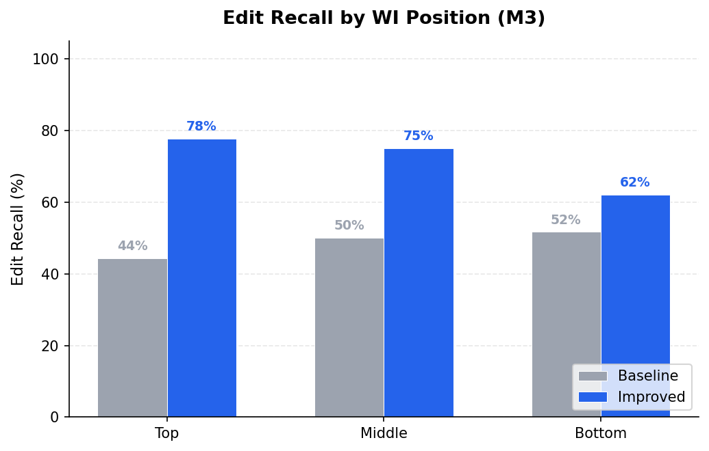
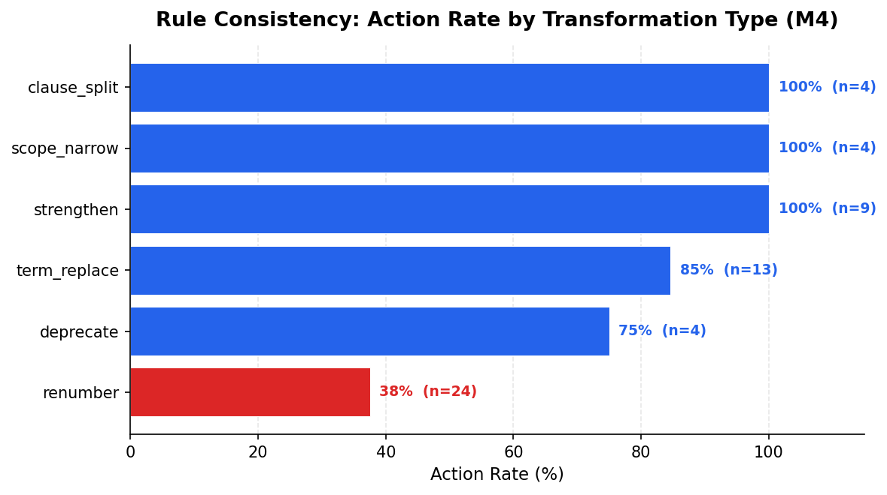
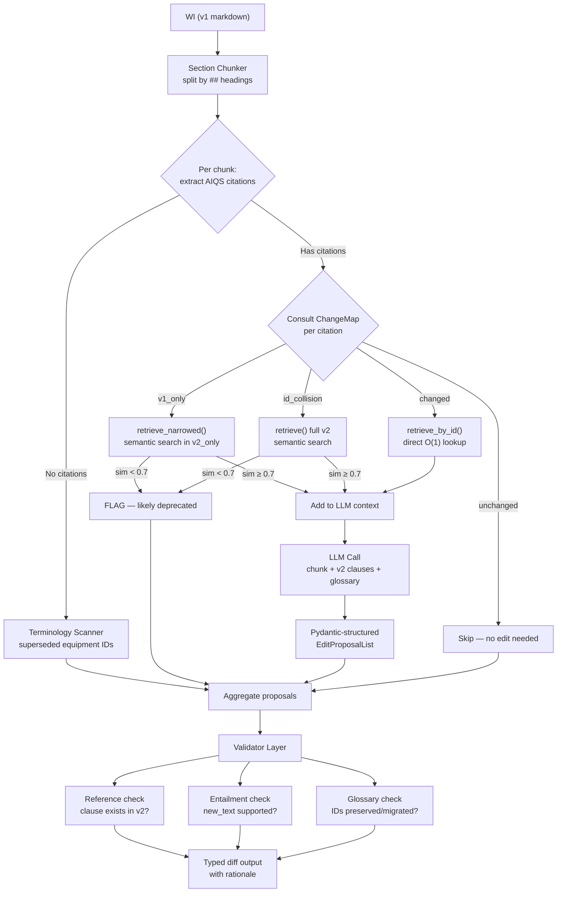

# GenAI Work Instructions Updater

A RAG-based pipeline that automatically updates Work Instructions (WIs) to comply with revised quality standards, with a quantitative evaluation framework that maps 1:1 to four observed failure modes.

**Headline results:** The improved pipeline reduces reference hallucination from 9.9% to 2.5%, closes the lost-in-middle position gap to 0.03 (effectively flat across positions), runs 3.4× cheaper per WI, and uses 61% fewer tokens — while achieving 100% action rate on 3 of 6 transformation types.

---

## Table of Contents

1. [Problem Statement](#1-problem-statement)
2. [Why Naive LLM Fails](#2-why-naive-llm-fails)
3. [Results](#3-results)
4. [Approach Landscape](#4-approach-landscape)
5. [Architecture](#5-architecture)
6. [Synthetic Corpus and Ground Truth](#6-synthetic-corpus-and-ground-truth)
7. [Evaluation Methodology](#7-evaluation-methodology)
8. [On-Prem Feasibility](#8-on-prem-feasibility)
9. [Limitations and Honest Failure Cases](#9-limitations-and-honest-failure-cases)
10. [Future Work](#10-future-work)
11. [Reproducing Results](#11-reproducing-results)

---

## 1. Problem Statement

Manufacturing companies maintain Work Instructions — step-by-step procedures describing how to operate machines, run inspections, and handle nonconformances. These WIs cite clauses from a central Quality Standard (comparable to ISO 9001 or IATF 16949). Standards update periodically — often twice per year. Each update makes dozens of WIs outdated: clause numbers move, requirements tighten, terminology changes, and entire clauses are deprecated or merged.

Updating WIs after a standard revision is manual. A quality engineer reads the change log, searches every WI for affected citations, proposes edits, and routes them through a review cycle. For a corpus of 30+ WIs and 100+ clauses, this takes weeks.

The obvious first attempt is to use an LLM: feed the full WI and the full updated standard into a single prompt, ask for edits. This works partially — the LLM can identify many required changes — but a naive approach reveals four systematic failure modes that block production use.

This project builds a structured pipeline that addresses all four failure modes, then measures the improvement with a quantitative evaluation framework most GenAI portfolio projects lack: computed ground truth with a hand-labeled honesty check.

All data in this repo is fully synthetic. The Acme Industrial Quality Standard and associated Work Instructions are generated programmatically to support reproducible evaluation.

---

## 2. Why Naive LLM Fails

A baseline pipeline (single prompt, full WI + full standard, no retrieval) was built and evaluated to characterize failure modes before designing the solution. Four systematic problems emerged:

**Failure mode 1 — Reference hallucination.** The LLM invents clause numbers that don't exist in v2, or retains v1 clause IDs that were renumbered or deprecated. In the baseline evaluation, 9.9% of proposals cite a nonexistent clause.

**Failure mode 2 — Lost-in-the-middle.** When the full WI (2000+ tokens) and full standard (10,000+ tokens) are in a single prompt, the LLM disproportionately misses edits in the middle sections. The baseline shows roughly uniform ~50% recall across positions — not because there's no lost-in-middle effect, but because recall is so low everywhere that the effect is masked by noise.

**Failure mode 3 — Inconsistent rule application.** The same type of change (e.g., `should` → `shall` strengthening) is applied in some WIs but missed in others. The baseline shows high variance across transformation types (σ = 0.30) with some types at 0% detection.

**Failure mode 4 — Terminology errors.** The LLM mangles company-specific equipment IDs (e.g., `2847.310.0042` becomes `2847.31.42`), fails to migrate superseded IDs to their replacements, and expands abbreviations inconsistently. The baseline produces zero proposals containing equipment IDs — it doesn't even attempt to address them.

Two common responses to these failures are iterative prompt engineering and fine-tuning a custom LLM. Both are incomplete framings. Prompt engineering yields diminishing returns and grows unmaintainable. Fine-tuning requires labeled training data that doesn't exist before a production pipeline has run. The standard 2026 solution is the middle stack: RAG with structured output and a validation layer. That is what this project implements.

---

## 3. Results

### Failure-Mode Metrics

| Metric | Baseline | Improved | Δ |
|---|---|---|---|
| M1 Reference hallucination | 9.9% (14/142) | 2.5% (2/79) | −7.4pp |
| M2 Substantive hallucination | N/A | 34.0% (17/50) | — |
| M3 Recall — top | 44.4% | 77.8% | +33pp |
| M3 Recall — middle | 50.0% | 75.0% | +25pp |
| M3 Recall — bottom | 51.7% | 62.1% | +10pp |
| M3 Gap (max − middle) | 0.02 | 0.03 | Flat |
| M4 Std dev across types | 0.30 | 0.22 | −0.08 |
| M5 ID preservation | 0% (n=0) | 96.7% (n=30) | — |
| M5 ID migration | 0% (n=0) | 100% (n=34) | — |
| Deprecated correctly flagged | 0/4 | 3/4 | +3 |

M2 was not computed for the baseline because baseline proposals are too noisy (9.9% hallucinated references) for an entailment judge to produce meaningful scores. The M2 denominator for the improved pipeline excludes citation-only changes (27 excluded), which are covered by M1 and M4.

### Rule Consistency by Transformation Type (M4)

| Type | Baseline | Improved |
|---|---|---|
| clause_split | 25.0% (n=4) | 100.0% (n=4) |
| scope_narrow | 50.0% (n=4) | 100.0% (n=4) |
| strengthen | 44.0% (n=9) | 100.0% (n=9) |
| term_replace | 38.0% (n=13) | 84.6% (n=13) |
| deprecate | 0.0% (n=4) | 75.0% (n=4) |
| renumber | 4.2% (n=24) | 37.5% (n=24) |

Three types at 100%. Renumber is the weakest — see [Limitations](#9-limitations-and-honest-failure-cases).





### Validator Layer

The validator is the backstop: after generation (Layer 1), it catches what the prompt missed. In production, proposals failing any gate would be rejected or routed to human review.

Results on the improved pipeline's proposals:

| Gate | What it checks | Failure rate |
|---|---|---|
| Reference | Does `clause_reference` exist in v2? | 2.5% |
| Entailment | Is `new_text` supported by the cited clause? | 34.0% |
| Glossary | Are equipment IDs preserved/migrated correctly? | 0% |

The entailment validator catches the 34% of proposals where the LLM made claims not directly supported by the cited clause — these would be routed to human review in production rather than auto-applied.

### Operational Metrics

| Metric | Baseline | Improved |
|---|---|---|
| Cost per run | $0.074 | $0.022 |
| Total tokens | 313,715 | 121,610 |
| Avg latency/call | 11.4s | 1.88s |
| Total proposals | 142 | 79 |

The improved pipeline is cheaper because it skips unchanged clauses entirely and processes only the relevant chunk per LLM call, rather than feeding the full WI + full standard in a single prompt.

---

## 4. Approach Landscape

Five approaches were evaluated against the four observed failure modes. Scoring: ✓ = directly addresses, ~ = partial, ✗ = does not address.

| # | Approach | Halluc. | Lost-in-mid | Rule consistency | Terminology | Effort | Key tradeoff |
|---|---|---|---|---|---|---|---|
| 1 | Naive single-prompt | ✗ | ✗ | ✗ | ✗ | Trivial | Baseline. Fails on all four modes |
| 2 | Prompt iteration + few-shot | ~ | ~ | ~ | ~ | Low | Caps below production quality; prompts grow unmaintainable |
| **3** | **RAG + structured diffs + validator** | **✓** | **✓** | **✓** | **✓** | **Medium** | **Recommended. Addresses all four with existing data** |
| 4 | Agentic multi-step | ✓ | ✓ | ✓ | ✓ | High | Real benefit is re-query on retrieval failure; not needed until #3's retrieval ceiling is hit |
| 5 | Fine-tuned domain LLM | ~ | ✗ | ✓ | ✓ | Very high | Blocked on training data that #3's human review loop generates |

**Recommendation:** Approach 3. It addresses all four failure modes at medium implementation cost with data any organization using quality standards already has (v1, v2, glossary).

Approach 4 is not rejected because agentic is a bad pattern — it is rejected because its specific benefit (recovery via re-query when retrieval underperforms) is not needed at the current retrieval-quality ceiling. The right time to revisit #4 is when the retrieval gate metric in #3 has been measured and shown to plateau despite prompt and retriever tuning.

Approach 5 is not deferred because fine-tuning is bad, but because its enabling data doesn't exist before a production pipeline has run. A human-in-the-loop review step is the mechanism that generates training data: every accepted, rejected, or edited suggestion is a labeled training pair. The baseline pipeline is not a throwaway — it is the data-generation engine that unlocks #5 in 6–12 months.

**Roadmap:** #3 (production now) → #4 (if retrieval plateaus) → #5 (when ~1000 validated edit pairs are accumulated).

---

## 5. Architecture

### Pipeline Overview



### ChangeMap — Structural Diff

The pipeline never sees the transformation log — that artifact exists only for evaluation. In a real deployment, only v1, v2, the WIs, and the glossary are available. The `ChangeMap` is computed at runtime by comparing v1 and v2 clause IDs and body text:

| Category | Definition | Pipeline action |
|---|---|---|
| `unchanged` | Same ID, same body in v1 and v2 | Skip entirely — no LLM call |
| `changed` | Same ID, different body | Direct lookup → LLM |
| `v1_only` | ID exists in v1, not in v2 | Narrowed semantic search among `v2_only` clauses |
| `v2_only` | ID exists in v2, not in v1 | Search space for `v1_only` fallback |
| `id_collision` | Same ID in both, but content completely unrelated (cascade renumber) | Full v2 semantic search |

This design is deliberate: skipping `unchanged` clauses before any LLM call eliminates an entire class of false positives (the LLM inventing edits for clauses that didn't change) and reduces cost by 61%.

### Chunking Strategy

WIs are chunked by `##` and `###` Markdown headings, which map directly to the procedural-section structure of the corpus. A hard 800-token ceiling per chunk is applied as a safety net — chunks exceeding this are split at the nearest paragraph boundary. No overlap between chunks, because clause references in this domain are section-scoped.

This choice directly drives the lost-in-middle metric (M3). By processing each chunk independently, the pipeline never feeds a context longer than ~800 tokens to the LLM. The M3 results confirm the sidestep works: the position gap (max − middle) is 0.03 for the improved pipeline, meaning there is no lost-in-middle effect.

### Glossary Injection — Two-Layer Design

The glossary contains 10 entries: 6 equipment IDs (plant-specific asset tags like `2847.310.0042`) and 4 abbreviations (ORR, NCR, FAI, LOTO). Two of the equipment IDs are superseded in v2.

**Layer 1 — Prevention (prompt injection):** The full glossary is included in every LLM call alongside retrieved v2 clauses. The model sees approved terminology during generation, reducing non-compliant output at the source. At 10 entries, the full glossary fits in every call; a scalability note for larger glossaries is in [Future Work](#10-future-work).

**Layer 2 — Catch (validator backstop):** After generation, the glossary validator checks whether terms in `new_text` match the glossary. Equipment IDs that should be preserved are checked for mangling; superseded IDs are checked for correct migration. This catches any violations Layer 1 misses.

This is a two-layer design (guidance + gate), not redundancy — each layer targets a different failure mode: injection prevents, validation catches. The results confirm: 96.7% preservation rate, 100% migration rate.

### Structured Edit Schema

Every proposal is a Pydantic-validated object:

| Field | Description |
|---|---|
| `clause_reference` | Dotted clause ID — must exist in v2 (reference validator enforces) |
| `action` | `edit` or `flag` |
| `rationale` | One-sentence explanation |
| `old_text` | Exact snippet from WI (verbatim copy) |
| `new_text` | Proposed replacement — entailment validator checks it is supported by the cited clause |

No `confidence` field. Self-reported LLM confidence is uncalibrated; including it would signal misunderstanding of what the model is actually reporting. If a confidence signal is needed later, it should be computed from generation agreement across independent runs.

---

## 6. Synthetic Corpus and Ground Truth

### Corpus Design

The entire corpus is generated by `src/data_gen.py`:

| Artifact | Description |
|---|---|
| AIQS v1 | 100 clauses — 5 chapters × 5 sections × 4 clauses. LLM-generated with structural constraints |
| AIQS v2 | 104 clauses. Produced by applying deterministic transformations to v1. Every transformation is logged |
| 30 Work Instructions | 10 short (2–3 sections), 12 medium (4–6), 8 long (7–10). LLM-generated with seeded clause references |
| Glossary | 6 equipment IDs + 4 abbreviations. Stored as `data/glossary.json` |

### v1 → v2 Transformations

Seven mechanical transformation types, applied in deterministic order:

| Type | Clauses affected | What changes |
|---|---|---|
| Deprecate | 4 | Clause removed from v2 |
| Clause split | 3 → 6 | One v1 clause becomes two v2 clauses |
| Clause insert | 5 | New clause in v2, no v1 counterpart |
| Term replace | 7 | Generic equipment name updated (e.g., `hydraulic press` → `servo-hydraulic press`) |
| Strengthen | 8 | Modal verb tightened (`should` → `shall`, `recommended` → `required`) |
| Scope narrow | 5 | Qualifier added (`all equipment` → `all Class-B rotating equipment`) |
| Targeted renumber | 8 | Clause moved to different section, body unchanged |
| **Unchanged** | **~57** | **Denominator for false-positive rate** |

### Computed Ground Truth

Ground truth is computed, not curated. A script crawls the WIs, finds every AIQS citation and affected terminology, cross-references the v1→v2 transformation log, and emits `expected_edits.json` automatically. This produces 148 entries across 30 WIs: 54 `edit_required`, 4 `flag_for_review`, 90 `no_action_required`.

The `no_action_required` entries are intentional — they are the negative examples that measure false-positive rate.

### Hand-Labeled Semantic Change Subset

The computed ground truth has a known limitation: the pipeline is effectively tested on whether it can reverse-engineer the same mechanical rules that generated the data. To separate real pipeline quality from mechanical pattern-matching, a held-out subset of 12 hand-labeled semantic changes is added:

| Category | Count | What it tests |
|---|---|---|
| Tone shift | 3 | Hedging language removed — enforceability tightened without structural change |
| Cross-reference chain | 3 | Clause A unchanged but references a deprecated clause B |
| Ambiguous scope | 3 | Precise qualifier replaced with vague term (`annually` → `periodically`) |
| Clause merge | 3 | Two v1 clauses collapsed into one v2 clause |

Ground truth for this subset is hand-labeled with `expected_behavior` (edit_required, flag_for_review) and evaluated separately from the main metrics. The result: 0/20 testable instances matched — both pipelines fail on semantic changes, which is the honest result. See [Limitations](#9-limitations-and-honest-failure-cases) for the full analysis.

The computed ground truth plus the semantic-change subset together are a central design choice: most GenAI portfolios rely on subjective evaluation because they lack ground truth. This one has both automated coverage and a hand-labeled honesty check.

---

## 7. Evaluation Methodology

### Gate Metric — Retrieval Quality (M0)

Retrieval is the foundation everything else sits on. M0 is reported first and gated: downstream metrics are only interpretable when retrieval is above target.

For each WI section with a ground-truth expected edit, did the retriever return the corresponding v2 clause in top-k? M0 is computed at k=1, k=3, and k=5.

M0 applies to the baseline pipeline (pure embedding search). It does not apply to the improved pipeline, which uses hybrid retrieval: direct ID lookup for `changed` clauses (deterministically correct) and narrowed semantic search for `v1_only` cases. The improved pipeline's retrieval quality is captured indirectly by M3 and M4.

### Failure-Mode Metrics

Each metric maps 1:1 to an observed failure mode from the baseline evaluation:

| Metric | Failure mode | How it's computed |
|---|---|---|
| M1 — Reference hallucination rate | Hallucinations (referenced) | % of edit proposals citing a `clause_reference` that doesn't exist in v2. Deterministic. FLAG and `0.0.0` proposals excluded from denominator |
| M2 — Substantive hallucination rate | Hallucinations (content) | % of `new_text` strings not entailed by the cited clause. LLM-as-judge (gpt-4o, temperature=0). Citation-only changes excluded |
| M3 — Position recall by bucket | Lost-in-the-middle | Recall vs ground truth, bucketed by WI section position (top/middle/bottom). Gap = max(top,bottom) − middle |
| M4 — Action rate by transformation type | Inconsistent rule application | For each type, fraction of expected edits the pipeline proposed. σ across types measures consistency |
| M5 — Terminology compliance | Company-specific terminology | Preservation: unchanged IDs kept verbatim. Migration: superseded IDs replaced correctly |

Every ✓ in the tradeoff table (Section 4) is earned by a number in this section.

### Operational Metrics

Cost, tokens, and latency are reported alongside quality metrics so reviewers see the full picture. A production system that works well but costs 10× more per WI than manual review is not a viable solution.

---

## 8. On-Prem Feasibility

The architecture is model-agnostic. The pipeline uses two model tiers (a cheap model for generation and a strong model for the entailment validator) with model names pinned as constants in `src/llm.py`. Swapping to a different provider — including on-prem or EU-hosted API endpoints for data-residency compliance — requires changing two strings.

No model weights are stored or fine-tuned in this repo.

---

## 9. Limitations and Honest Failure Cases

### Renumber recall: 37.5% (24 instances, 9 detected)

Cascading renumbers — where a clause is moved across sections and its old ID is re-occupied by a different clause — are the pipeline's weakest transformation type. The ChangeMap categorizes these as `id_collision`, and the semantic search sometimes finds a spurious match rather than the true target. Without the transformation log, the pipeline cannot distinguish a renumber from a deprecation. This is an architectural ceiling of inference-by-similarity, not a bug.

### Deprecated clause: 1/4 missed

All 4 deprecated v1 IDs are re-occupied in v2 (by renumbers or inserts). For 3/4, the content mismatch is large enough to flag correctly. For 1/4, the full v2 search finds a spurious match above the 0.7 similarity threshold, causing the LLM to generate an edit instead of a flag. Same root cause as renumber.

### M2 substantive hallucination: 34%

Three patterns account for most not-entailed judgments: (1) equipment-ID changes attributed to the wrong clause, (2) renumber consolidation of multiple citations into one, and (3) legitimate hallucinations where the LLM made content claims not supported by the cited clause. The validator layer catches these at runtime — proposals failing entailment would be routed to human review in production rather than auto-applied.

### Semantic changes: 0/20 match

The 12 hand-labeled semantic changes (20 testable instances across WIs) expose three architectural limitations:

| Category | n | Outcome | Root cause |
|---|---|---|---|
| xref_chain | 5 | All miss | Pipeline skips `unchanged` clauses. Chain breakage (clause text identical but referenced clause deprecated) is invisible without a dependency graph |
| tone_shift | 8 | 5 wrong, 3 miss | Pipeline always generates `edit` for `changed` clauses. Cannot distinguish structural change from judgment-requiring change |
| ambiguous_scope | 4 | 4 wrong | Same mechanism as tone_shift |
| clause_merge | 3 | 3 wrong (flagged instead of edited) | Absorbed clause lands in `v1_only`; narrowed search returns low similarity → flag instead of edit |

0 matches is the expected and honest result. The semantic subset exists to prove the pipeline doesn't game the mechanical eval — it genuinely cannot solve what requires human judgment.

---

## 10. Future Work

### Immediate improvements (identified, not implemented)

Three targeted improvements identified from the semantic eval analysis. Not implemented to avoid overfitting to the eval corpus.

**1. Cross-reference dependency check.** Before skipping an `unchanged` clause, parse its v2 body for AIQS references. If any referenced clause no longer exists in v2, generate a `flag`. Purely deterministic (regex + lookup). Would address all 5 xref_chain misses. Effort: ~1–2h, low regression risk.

**2. Change-type classifier.** For `changed` clauses, add a lightweight LLM classification step: is this change structural (→ edit) or judgment-requiring (→ flag)? Signals: hedging removal, qualifier loosening → flag; new obligation → edit. Would partially address tone_shift and ambiguous_scope. Effort: ~2–3h, medium regression risk.

**3. Merge detector.** Lower the similarity threshold for `v1_only` cases to ~0.4 and let the LLM decide whether to edit or flag when a partial match is found. Would address clause_merge. Effort: ~1h, requires threshold calibration.

### Roadmap

**Approach #4 — Agentic multi-step.** The specific benefit of an agent is recovery via re-query when retrieval underperforms. The right time to add this is when the retrieval quality (measured by M4 renumber rate) has been optimized and shown to plateau. Current renumber recall (37.5%) suggests room remains for retriever-level improvements before an agent is justified.

**Approach #5 — Fine-tuned domain LLM.** Requires ~1000 validated edit pairs that don't exist before a production pipeline has run. A human-in-the-loop review step is the data-generation engine: every accepted, rejected, or edited suggestion is a labeled training pair. Running this pipeline in production with human review for 6–12 months generates the training dataset organically.

### Glossary scalability

The current implementation dumps all 10 glossary entries into every LLM call. For a production glossary with hundreds of entries, this would be replaced with retrieval-based glossary injection: embed glossary entries, retrieve only the entries relevant to each chunk's content. The architecture supports this without structural changes.

---

## 11. Reproducing Results

### Prerequisites

```bash
pip install -e .          # or: pip install openai chromadb pydantic python-dotenv matplotlib
cp .env.example .env      # add your OPENAI_API_KEY
```

### One command

```bash
python scripts/reproduce_results.py
```

This runs in eval-only mode by default: it assumes pre-computed pipeline results exist in `results/` and runs the evaluation harness, validators, semantic eval, and generates the comparison document and figures. Cost: ~$0.10 (entailment judge). Time: ~2 minutes.

### Other modes

```bash
python scripts/reproduce_results.py --full     # re-run pipeline + eval (~$0.25, ~10 min)
python scripts/reproduce_results.py --smoke    # 2-WI wiring check (~$0.02, ~1 min)
python scripts/reproduce_results.py --skip-m2  # skip entailment judge (free, faster)
```

### Running tests

```bash
pytest tests/ -v
```

19 tests. All run without API calls (LLM mocked). Covers: validator unit tests, Pydantic schema contracts, ground-truth consistency, and end-to-end smoke.

### Repo structure

```
genai-wi-updater/
├── README.md
├── pyproject.toml
├── .env.example
├── data/
│   ├── standards/              # acme_qs_v1.md, acme_qs_v2.md (+ .json)
│   ├── work_instructions/      # WI-001.md … WI-030.md
│   ├── glossary.json
│   ├── transformation_log.json
│   ├── wi_metadata.json
│   └── ground_truth/
│       ├── expected_edits.json         # auto-computed (148 entries)
│       └── semantic_changes.json       # hand-labeled (12 entries)
├── src/
│   ├── llm.py                  # model constants + OpenAI client
│   ├── data_gen.py             # synthetic corpus generator
│   ├── schemas.py              # Pydantic data models
│   ├── chunker.py              # WI section chunker
│   ├── retriever.py            # ChangeMap + ChromaDB hybrid retrieval
│   ├── pipelines.py            # baseline() + improved()
│   ├── validators.py           # reference + entailment + glossary gates
│   ├── run_pipeline.py         # CLI orchestrator
│   └── eval.py                 # M0–M5 + ops metrics
├── scripts/
│   ├── reproduce_results.py    # one-command reproduction
│   ├── eval_semantic.py        # semantic subset evaluation
│   ├── generate_figures.py     # matplotlib charts
│   └── generate_results_doc.py # baseline_vs_improved.md generator
├── tests/
│   ├── test_validators.py      # 12 unit tests
│   ├── test_schemas.py         # 3 contract tests
│   ├── test_ground_truth.py    # corpus consistency
│   └── test_smoke.py           # end-to-end wiring
└── results/
    ├── baseline/               # 30 WI outputs + metrics
    ├── improved/               # 30 WI outputs + metrics + validation
    ├── baseline_vs_improved.md
    └── figures/
        ├── position_recall.png
        └── m4_by_type.png
```
